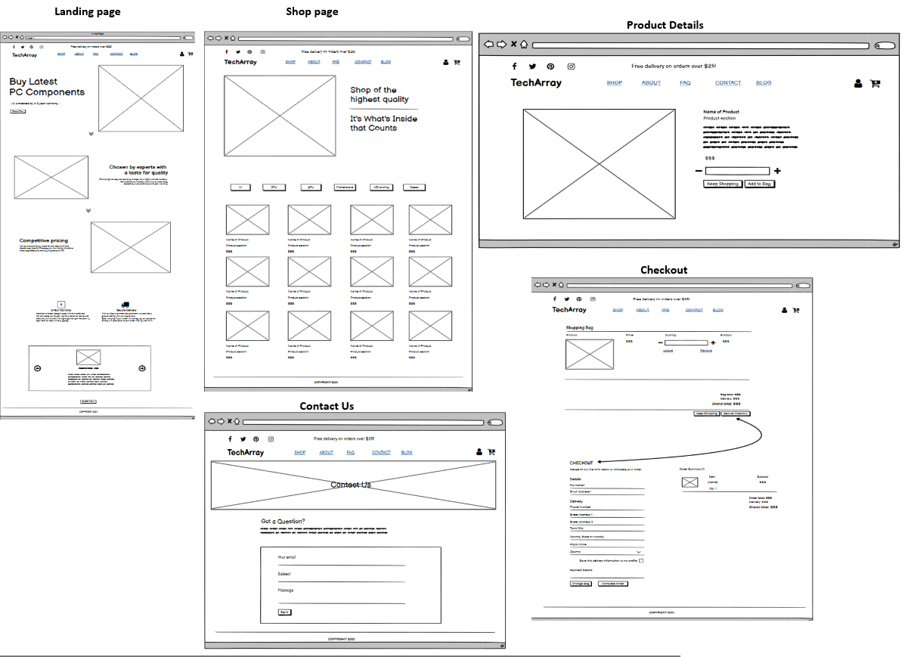

# Milestone 4 Project – TechArray

TechArray website has been build as a final project with Code Institue. Knowledge used in this project has been gained solely from the Code Academy.

It is fully responsive website with full-stack functionality, focusing on being user-friendly. The website is a PC Components store.

A demo of the website can be found here [TechArray](https://samisinnari-techarray.herokuapp.com/)


The image above is a screenshot from [Am I Responsive](http://ami.responsivedesign.is/#)


---

## Contents

- [**User Experience (UX)**](<#user-experience-(ux)>)

  - [Project Idea](#project-idea)
  - [Structure](#structure)
  - [User Goals](#user-goals)
  - [User Stories](#user-stories)
  - [Design](#design)
  - [Wireframes](#wireframes)

- [**Features**](#features)

  - [Existing Features](#features)
  - [Features Left to Implement](#features)

- [**Testing**](#testing)

- [**Technologies**](#technologies)
  - [Tools Used](#tools-used)
  - [Authentication](#authentication)

- [**Deployment**](#deployment)

- [**Credits**](#credits)
- [**Acknowledgements**](#acknowledgements)

---


# User Experience (UX) <br>

## Project Idea

TechArray is a website that promotes PC Components. The focus of the website is to sell newest ( or latest) PC parts for personal or business use. 

Website users will have the option to create an account in order to preview their previous orders and they will have the option to save their delivery details for faster purchase in the future.

The project Idea has been expanded into a website due to my passion for PCs and everything connected to a PC.


## Structure

There are 6 main pages including the home page and a login/registration page. Other than these, there is a base page which serves as the base for all the other pages. 

### **The home page**
 The home page section will showcase the main values of the company. It is created with attractive and modern design, with button that connects to the shop. Moreover, users are provided with testimonials and footer with social media links.

### **About page**

The link "About" will transfer the user to the section on home page, which explaines the quality of our products.

### **FAQ**

Frequ. asked question page will do what it's name says. It should give users answers to the most common questions. Due to lack of time, this section has been customized only with HTML & CSS. In the **future**, FAQ page will be developed with Django App so we can update it if needed.

### **Shop page**

Shop section will show users the products we offer. To make navigation easier for users, I have added 5 buttons (+ "All Items" button) so they can categories all the products. They will be presented with Image of the product, name, what section it belongs and the price. If user clicks on the product, they will be transferred onto a product detail page, where they can choose the quantity of the product before adding it to the cart. Moreover, If they want to go back, they are given option to go to "All items", that same product family or back to the shop.

### **Shopping bag page**

If user decides to purchase a product, they can add product to the shopping bag. Once they click "Add to Bag", a notification is given showing that the product has been added and what other items are in the cart already ( if previously added). Moreover, once user clicks "Go to secure checkout", they open a Shopping Bag which shows details of the products. Details include : Picture, Name, Price, Quantity and Subtotal. Below product detail, they are given "Bag Total", "Delivery(Free/NotFree)" and "Grand Total". There, they can decided whether to go back ( "Keep Shopping" ) or whether to make a purchase by proceeding to "Secure Checkout".

### ****Checkout page****

Here the user can enter their billing details to complete the checkout. If they need to update the cart at any point before billing, they have the option to go back to the Shop by clicking on a button. Nevertheless, the users are provided with an option to save their details by logging into the site. If they don't want that option, they can click on Complete Order button to complete the transaction which triggers an automatic mail to their email address provided with the necessary details. If they want to save the details for future, they can register or login from the page or from the navbar. 

### **Login page**

Every visiting person is recommended to sing in. On sign in page, they have the option to save login info (like email address/username) with "Remember me" box. Moreover, they have the link to reset their password if forgotten, and they have the option to Sing Up if they still don't have an account. To sign up, they will have to provide relevant personal info, and conformation email will be sent to their email address. Once email is confirmed, they will enter their login details and at this point the account is activated.

### **Profile page**

The logged in users can update their billing details from this page. If they have made any previous purchases, those details are also presented in this page. 

### **Logout page**

For users logged in, they can click on the logout button which will transfer them to the page where they have to confirm the signout. Once confirmed, they will be logged out successfully.

### **Blog page**

The blog page is an app created to give a personality to the website. It will focus on PC connected ideas and thoughts. The focus of a blog is to promote interactivity on the website hence bringing people together to share thoughts. Info about blog posts are give, like : Username of a person posting, time and date. Once users click "Read More", they wil be able to read full blog post.


### **Comments**

Comments are specifically connected with the blogs to give users availibility to interact on the website. They can exchange thoughts and ideas via comment section. To control comments, the **Site owner** is approving every comment seperately.

### **Contact page**

This page provides a form which they can fill in to contact the companys customer support department, whether they have any inquiries or similar.

### **Management section**

This section is available only for admin person. The admin of the website has options to : 
 - Add, Delete or Edit products
 - Approve or disapprove comments posted
 - Add blogs content.

  #### [Back to Contents](#contents)
<br>

## User Goals


* Purchase a product
* Learn more about the products offered.
* Interact on a website
* Gain more knowledge by reading some articles.

## User Stories

 **New user stories**
  - As a new user, I want to be able to learn more about the company I'd like to purchase from.
  - As a new user, I want to be easily navigated throughtout the website.
  - As a new user, I want to see the products offered with ease.
  - As a new user, I want to register for an account so that I can save my personal information for my future orders.
  - As a new user, I want to read FAQ to see if I get some questions already answered.
  - As a new user, I want to be able to contact the company if I have any question.
  - As a new user, I want to check the social media sites of the company, and see their opening hours as I prefer talking to a human.

 **Registered user stories**

  - As a registered user, I want to be able to have my delivery details prefilled so that I can save time in entering my details
  - As a registered user, I want to be able to view my past orders so that I can keep track of my orders with the site
  - As a registered user, I want to be able to easily update my profile information so that I can update my personal details
  - As a registered user, I want to be able to easily log in and out of my account so that I can access my personal information and order history

 **Shopped user stories**

  - As a shopper, I want to contact the website owner so that I can ask them a question.
  - As a shopper, I want to see all components available so that I can decide which product I might purchase.
  - As a shopper, I want to view details of a product so that I can learn more about that particular product.
  - As a shopper, I want to choose the number of products I want to order.
  - As a shopper, I want to be able to delete products from my cart so that I can update the products I would like to purchase
  - As a shopper, I want to receive an order confirmation so that I can be sure my order has gone through.
  - As a shopper, I want to learn more about TechArray through blog articles and testimonials.
  - As a shopper, I want to contact the website owner so that I can ask them a question if I have any.


## The Site Owner:

**Site owner goals**

- Attract large quantity of users with appealing website design with stable functinality.
- Adding and removing of products.
- Managing the website content
- Update the blog section with new content.


**Site owner user stories**

- As a site owner, I want to easily list my products for sale. 
- As a site owner, I want to impress new users with modern looking website.
- As a site owner, I want to be able to easily remove, edit and add products as some may be out of stock or otherwise.
- As a site owner, I want to navigate users throughout the webiste with ease via navigation panel.
- As a site owner, I want to highlight FAQ for users hence lower the customer support demand via separate link.
- As a site owner, I want to add secure checkout to the website.
- As a site owner, I want to add free delivery if delivery treshold is reached.
- As a site owner, I want to send auto emails to users so that I can inform them of successful registration and order confirmation.
- As a site owner, I want to sort the products available on the site by category so that I can view just the products in that category.
- As a site owner, I want to spread knowledge of a PC and PC building by making a Blog.


  #### [Back to Contents](#contents)
<br>


## Design

* The website is created in an easily navigatable manner with sections added in the navbar. When user is not logged in, it includes Shop, About, FAQ, Contact and Blog. When the user is logged in, They will be able to visit their profile under "My Account". Moreover, Superuser has an extra navigation link. Superuser will be able to add products directly via the link.
The buttons and links - the information architecture is placed logically depending on the page. The website is created in a modern and attracive layout, with eye-pleasing colors.

* Navigation bar is designed in simplicity as well. The title of the website is in the middle, whereas links are on both sides. Above Website title, a note is added advising users of the amount they have to spend in order to avail of free delivery.

* Products page is clear and immediately understandable. Same with shopping bag and checkout page.

* Color schema is similar on landing, Blog and FAQ pages. Since I was unable to match the background image with Contact Us page, I have added very similar colors just to match the websites overall design.

  #### [Back to Contents](#contents)
<br>


## Wireframes

- I have created wireframes before making this project, therefore there are some minor differences. As I was coding the website, I decided to change the navigation bar by removing social links, and adding them to the page footer. I moved the company title in the middle and website links to the left. Moreover, I have replaced "Copyright" section of the footer with company info and social links.

- On product detail page, I decided to add two additional buttons. One that leads to that product family, and one that leads to all products.

- On FAQ page, I added background Image.

- On Blog page, I decided to add name of the person posting, date of the post and time.

- On profile page, I decided to remove the footer simply to make user experience nicer.

**Please find all wireframes [here](static/readme/wireframes-techarray.pdf)**




  #### [Back to Contents](#contents)
<br>


## Features

### Existing Features

* Navigation bar - The navigation bar is divided into 3 section. First is website links which will guide users throughtout the website. The second is the title of the company, which in the same time is a home button. Third section is My Account and Shopping bag. Under My Account, users can login/ register or they can even visit their profile. If the user is Superuser, they have the option to manage products.

* FAQ - This section will give users answers to most commonly asked questions. The aim of this web page is to lower the incoming contact to our customer support team, by simply replying to questions they might want to ask our company.

* Contact - If by any chance users have more detailed or specific questions, they have the option to contact our team directly by simply sending us a message via Contact page. Contact page has been created with Django app therefore automatic message will be sent once they contact us, advising that we will get back to them asap.

* Blog - Blog is a page created for interactivity on the website. As most PC connected companies, we want to give some advices to users or PC enthusiasts whether how to build a PC from scratch, or the best way to apply thermal paste.

* Comments - Every posted blog has the luxury of comments. To share knowledge, users can post a comment with their ideas or even express different opinions. It is open to everybody therefore superuser will have the option to leave comment in draft or to approve it.

* Shop - Shop will show all the products we have to offer. Users can click on the picture or name of the product, and bring a special product detail page which contains indepth information about that particular product.

* Search - I added a search bar to the website and gave the users availablity to search for their particular product either by name or description. I added search bar within the navigation bar, hence making navigation througout the website simpler.

* Delete/Edit/Update/Add ( Only for superuser) - Options mentioned are provided ONLY for superuser of this website. Superuser can manage all the products on the website and media files as well. Moreover, superuser can even delete comments and add new Blog content.


### Features Left to Implement

* FAQ app Django design - Due to lack of time, I created FAQ page with HTML and CSS. The future plan of this website is to create FAQ specifically with Django app, hence making updating of this section much easier. IT world is changing more day by day, therefore we might need to add more FAQ or even change some.

* Remove/Delete Button - I am planing to add a question pop-up on delete button. Now, if superuser wants to delete an item it will be done immediately by pressing delete. I am planing to add a confirmation of delete simply as a protection as superuser might clicks remove on the wrong product.

* Subscribe - To keep users in line with our new items, I am planing to add subscribe button which will automatically send subscribed users our new products in the shop.

* Back to Top - My first idea was to add "Back to top" button on the website, but this was not required as my navigation bar is sticky. In the future, Once the shop is expanded, back to top button will be added.

  #### [Back to Contents](#contents)
<br>


## Testing

This website has been tested on many different occasions. Besides manual testing on different sites and browsers, the site has been tested by my mentor and Code Institute students. Moreover, the website has been tested on most devices on [BrowserStack](https://browserstack.com).

### Automated Testing

- Next to Manual testing, I have created automated tests for Blog, Checkout, Products and Contact pages. Please find them within the code tests.py files.

### Manual Testing

- For Manual Testing I have used [BrowserStack](https://browserstack.com) as mentioned. The website appeared fully functional on each device with no errors.

- Additionaly, website has been tested in details. Results can be found below : 


### Testing user stories

To read full *User Stories* testing, click [here](static/readme/testing.pdf)

**New User**

 *As a new user, I want to get more information about the company before I decide to place order with them.*
- When a user comes to our website, they will be welcomed with attractive modern looking website, promoting only latest PC parts.
- Users will be given detailed description of the Companys qualities as they continue to progress throughout the about section.
- Users are provided with the graph highlighting that we are one of the cheapest on the market
- Next to above, users are provided with the options to “Take a Tour” of our products and get familiar with the store

*As a new user, I want to know what previous/current users think about the company*
- Since some users would like to see reviews of the company, I have added testimonials section which showcase the best reviews received.

*As a new user, I would like to see the products company has to offer in quick, efficient and easily accessible way.*
- For users looking to purchase product straight from the landing page, I have added a link which leads to a shop page next to a banner picture, and “Shop” link has been added first in the navigation bar.
- Additionally, I have added a link to the “Shop” at the end of the page for userswho decide to purchase a product after reading the “About” or testimonials section.

*As a new user, I want to read some FAQ, in order to get more information about common queries.*
- For users wanting to know the most common questions regarding delivery, payments and product (etc...), I have added a FAQ page which should clarify all the questions they might had, with the aim to avoid any confusion so they wouldn’t need to contact our customer support team for minor queries.

*As a new user, I want to be able to easily register for an account so that I can see and save my personal details for faster ordering in the future.*
- When a user decides to register for the account, they are given the option in the right side of the navigation bar for registration or in the mobile toggler menu.
- Once they click on the account icon, they can register with email. For better security, they will be sent a conformation email onto their own email address. Once they confirm their 
email address, they will be taken to the homepage and be informed via a notification that they have successfully signed up.
- Once logged in, user is able to update delivery address, which was prior saved while making the first order, by checking the box next to “Save this delivery information to my profile”.
- If a user is at the checkout point without having registered for an account thus far, they will be prompted that they can do so at this point, where the checkbox is replaced with a login/register link.

**Registered User**

*As a registered user, I want to be able to easily log in and log out of my account so that I can access my personal information and order history.*
- By using My Account link from the main navigation and within the toggler on mobile, users can quickly find the login button from the dropdown so that they can log into their account. Likewise, they can use the same process to find the Logout button when they wish to log out of their account.

*As a registered user, I want to be able to easily update my profile information.*
- Whilst being on their profile, registered users are able to edit their profile information in order to have their next checkout done faster. The user will then be notified by a pop-up message to inform them if the change was successful.
- Moreover, they are able to modify their delivery information when placing a new order. Before proceeding to the secure checkout, they can tick the box to save delivery information, hence new details will be updated.

*As a registered user, I want to be able to view my past orders so that I can keep track of my orders with the company.*
- Once a user is logged into the website and is on the profile page, they will be able to view a list of their past orders. The details include the order number, date and time of order, the items they ordered and the order total. By hovering on the order number, they will be able to view the full order number.
- By clicking on the order number, which is highlighted, the user will be taken to a new page and be able to view that

**Shopper**

*As a shopper, I want to see all the products available at the moment.*
-Once user clicks “Shop” link, they are redirected to the page which contains all of our products in one page. If user needs more information about some particular product, they can click on the product image and will be taken to a product detail page

*As a shopper, I want to see different products, the ones that suit my needs.*
- Once user is on the “Shop” page, they have 6 different buttons available. One (“All”) which shows all of our products, and other 5 that show different types of products currently for sale.

*As a shopper, I want to choose the quantity of the products as I might need to buy more than one.*
- Every product has the option for increasing the quantity. If user opens product detail page, they will see the current quantity and buttons which will allow them to increase or decrease the number of products they want to add into their bag.
- Additionally, users are given the option to change the quantity of products inside their bag. If they decide to optout, remove button is presented under each product in the shopping bag.

*As a shopper, I want to be able to add the product to my cart*
- Users are given the option in the product detail page, to add that selected product to their shopping cart.
- Once they add the product to the cart, they will receive a notification reminding them of the bag balance and the items already in the bag (if any).
- Moreover, they will be told the amount to spent for free delivery (If free delivery not already awarded).

*As a shopper, I want to read some reviews of that company and read some blogs regarding the PC’s.*
- For users, testimonials section is provided to showcase some of our best compliments in order to attract them to buy from us.
- The blog page has been added to make website modern, as most of techrelated website have that section. There, they can read some PC related articles and read comments of other users. If they wish to add a comment, they will have to enter their name and email address.

*As a shopper, I want to be able to contact the website owner.*
- In the main navigation is a link to a Contact page. On this page, users can send a message to the site owner by filling out simple form


**Site Owner**

*As the site owner, I want to be able to offer visitors free delivery based on a minimum amount ordered so that I can increase revenue and product sales via an incentive to the customer.*
- Added a banner informing the users that we offer free delivery if they spend more than $25 ( changed to $300 in live website)
- when a user adds items to their bag, if the total cost of the order does not add up to the minimum about required for free delivery, the popup notification of successfully adding the item to the bag will also display a notice of how much more the user needs to spend to get free delivery.
- Additionally, on the bag page, the user will also see some text above the Secure Checkout button informing them of how much more they need to spend to get free delivery.

*As a site owner, I want to inform users via email of every successful order or registration.*
- Automated emails are being sent to users as soon as they register asking them to confirm their email address.
- Moreover, on every order placed, users will receive a conformation email with additional information regarding their order.

*As a site owner, I want to make shopping easy for our users.*
- The website has been built userfriendly. Three “Shop” buttons are added in the landing page.
- Once in the shop page, users are able to switch thought products by clicking the buttons provided. Each button leads to a different components.
- Once user opens product detail page, he is given the option to increase or decrease a quantity. For components with size, user is able to pick a size in GB (Gigabyte).
- Additionally, once user adds product to the cart, notification is given informing that item is now in the card.
- The checkout process has also been implemented in a way to make it as easy as possible for users to place an order, with a simple form and instructions.

*As a site owner, I want to be able to list my products when there is a new item in sale or when I need to update some product information.*
- Superuser is able to add or update new products.
- When browsing the products, two buttons are below every item, “Edit” and “Remove”. Once superuser clicksEdit, new page appears with a simple form and availability to update the product. Once “Update” is clicked, notification is displayed that the item is now updated

To read full *User Stories* testing, click [here](static/readme/testing.pdf)


  #### [Back to Contents](#contents)
<br>


## Technologies

* [HTML](https://html.com/)
* [CSS](https://www.w3.org/Style/CSS/Overview.en.html) 
* [JavaScript](https://www.javascript.com/) 
* [JavaQuery](https://jquery.com/)
* [Django]( https://www.djangoproject.com/)
* [GitHub](https://github.com/)
* [GitPod](https://www.gitpod.io/)
* [Heroku](https://www.heroku.com/)
* [Stripe](https://stripe.com)
* [Amazon Web Services]( https://aws.amazon.com/)

### Tools Used

* [Balsamiq](https://balsamiq.com/) - I used Balsamiq to create wireframes for this project
* [W3C HTML Validator](https://validator.w3.org/) - I used this tool to check the validity of my HTML code.
* [W3C CSS Validator](https://jigsaw.w3.org/css-validator/) - I used this tool to check the validity of my CSS code.
* [Autoprefixed](https://autoprefixer.github.io/) - I used this tool to check the prefixes on my CSS code.
* [PEP8](http://pep8online.com/) - I used this tool to check that my python files meet the PEP8 requirements.
* [JSHint]( https://jshint.com/- I used this tool to check for errors in my JavaScript code.

### Authentication

The website authentication is provided by Django App Allauth. <br>
A user must follow the instructions on the ‘Register’ page (enter an email address, username and password) and then confirm their email address via the email they receive. Once this has been completed user can sign in to the website.

#### [Back to Contents](#contents)


## Deployment 


I used Gitpod to develop the site using Python 3 and deployed to Heroku via Github. <br>

### Local deployment
1. To run the site locally, you can either download a zip file of this repository by clicking 'download.zip' button at the top of the page and extracting the zip file to your chosen folder or clone this repository. See the steps to clone the repo here : https://docs.github.com/en/github/creating-cloning-and-archiving-repositories/cloning-a-repository. <br>
If you are cloning the site, make sure you have Python 3 installed for this to work. 

2. Then create a virtual environment with your IDE. Open your preferred IDE, then open a terminal session in the unzip folder or cd to the correct location. 

3. Install the required dependencies with the following command:
```
pip3 install -r requirements.txt
```

4. Create an env.py file and add the following with your own values:
```
import os  
os.environ["DEVELOPMENT"] = "True"    
os.environ["SECRET_KEY"] = "<your value>"    
os.environ["STRIPE_PUBLIC_KEY"] = "<your value>"    
os.environ["STRIPE_SECRET_KEY"] = "<your value>"    
os.environ["STRIPE_WH_SECRET"] = "<your value>" 
os.environ["EMAIL_USER"] = "<your value>"
os.environ["EMAIL_PASS"] = "<your value>"
```
(Django Secret Keys can be generated with websites such as [miniwebtool](https://miniwebtool.com/django-secret-key-generator/).)

5. Add the env.py files to .gitignore so that it is not published at any stage. This is to keep the secret keys and values safe.

6. You need to make migrations to set up the SQLite3 tables. You can do that by:
```
python3 manage.py makemigrations
python3 manage.py migrate
```

7. Create a superuser for your project by using the following command:

```
python3 manage.py createsuperuser
```

8. You can now run this locally by the following command:

```
python3 manage.py runserver
```

9. Once the site is running locally, go to the end of the url and type in /admin to add templates, blogs, comments etc.


### Deploying this project to Heroku 

Once you have set up locally, you can deploy to Heroku by following the below steps:

1. Create an account in Heroku if you dont have one or sign in if you have an existing one

2. In Heroku, create a new app with a unique name and set your registration

3. To use the Postgres database for deployment, select 'Heroku Postgres' as a free add-on.

4. Go to Settings in Heroku, click on 'Reveal Config Variables' and enter the following values

| **Key** | **Value** |
--- | ---
 AWS_ACCESS_KEY_ID | your AWS bucket ID
 AWS_SECRET_ACCESS_KEY | your AWS secret key
 DATABASE_URL | your Heroku Postgres database url
 EMAIL_HOST_PASS | your password to use your gmail account for emails
 EMAIL_HOST_USER | your email address
 SECRET_KEY | secret key used for your Django project
 STRIPE_PUBLIC_KEY | obtained through your Stripe account
 STRIPE_SECRET_KEY | obtained through your Stripe account
 STRIPE_WH_SECRET | obtained through your Stripe account
 USE_AWS | True

 5. You need to login to Stripe, go to the developers section to get the pubic key ad secret key. For the AWS secret key, you need to login to AWS and create a new bucket. Creating a new S3 bucket documentation can be found [here](https://docs.aws.amazon.com/AmazonS3/latest/gsg/CreatingABucket.html)

 6. In Gitpod, create a requirements.txt file:
```
pip3 freeze --local > requirements.txt
```

7. Create a Procfile:
```
echo web: gunicorn tech_array.wsgi:application> Procfile
```

8. As with local deployment, make migrations to set up the Postgres database:
```
python3 manage.py makemigrations
python3 manage.py migrate
```

9. Create a superuser similar to the way in local deployment

10. Run the server

11. As with the local deployment, add /admin to the url to go to the admin and add or edit 

12. Add and commit your changes

13. Login to Heroku by using the command 
```
heroku login -i
```
14. Once logged in, link your Heroku app created above as the remote repository with this command:
```
heroku git:remote -a <your app name here>
```
15. Complete the deployment by pushing the projekt to Heroku:
```
git push heroku master
``` 
16. In Heroku, go to the Deploy tab and connect your app to your GitHub repository and **Enable Automatic Deployment** as the deployment method to automatically push the changes to Heroku from Github

17. Your site would now be deployed to Heroku

#### [Back to Contents](#contents)


## Credits

**FAQ Page**: Code added on FAQ page has been inspired by Vanila CSS collapsible drawers : https://codepen.io/builtbyluke/pen/dBVVQR

**Blog Content**: Blog Content has been copied from [Tech Deeps website](https://tekdeeps.com/technology/)

**Media Files** :
- Landing Page/Shop/FAQ/Contact/Blog - All pictures were Licensed on [Adobe Stock](https://stock.adobe.com/ie/)
- Products - All pictures in Shop section are public and open therefore taken from the each company website.
- Blog - Thermal paste: Photo by Mika Baumeister on Unsplash | Liquid Coller: Photo by Šimom Caban on Unsplash | Monitor: Photo by FOX from Pexels
- Icons - All Icons on the website were aquired on [Flaticon](https://www.flaticon.com)

**Blog**: For a Blog section, I followed tutorials with some personal additions:
- [Blog app](https://djangocentral.com/building-a-blog-application-with-django/)
- [Blog comments](https://djangocentral.com/creating-comments-system-with-django/)
- [Blog pagination](https://djangocentral.com/adding-pagination-with-django/)

**Contact**: In order to make Sending email application functional, I followed this tutorial with some personal additions:
- [Django Email/Contact Form](https://learndjango.com/tutorials/django-email-contact-form)

#### [Back to Contents](#contents)


## Acknowledgements 

First and Foremost, I would like to thank my amazing mentor Can Sucullu. His experience and advices have been of immense help to me. The knowledge he provided me with is something to keep.

I would also like to thank Tutor support team, especially Michael, Tim, Igor, Sheryl and Miklos with all the help provided. They helped me solve many errors I faced and for that I am truly grateful.

Moreover, I would like to express my gratitute to Code Institute Staff for providing me with necessery knowledge and proper guidelines throughout my time with Code Academy.

And lastly, to all slack members that took time to look into my Project and point out my misses, I express my sincere thanks.

#### [Back to Contents](#contents)